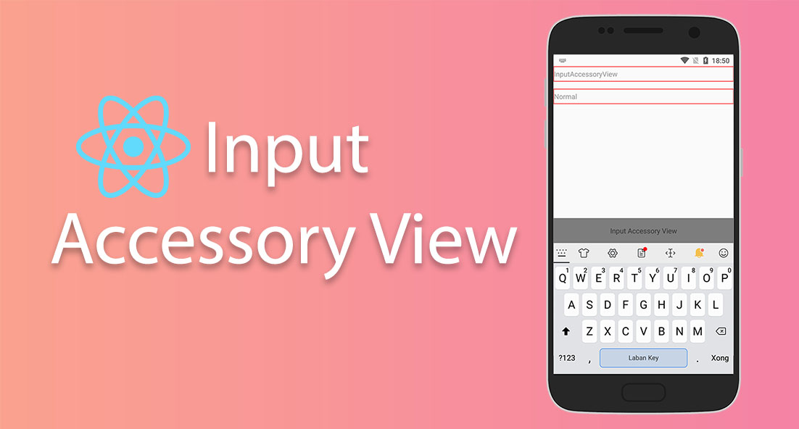

## React Native Input Accessory View

[![Version][version-badge]][package]

[version-badge]: https://img.shields.io/npm/v/react-native-input-accessory-view
[package]: https://www.npmjs.com/package/react-native-input-accessory-view

An universal [InputAccessoryView](https://reactnative.dev/docs/inputaccessoryview) for Android and iOS

## Installation

```sh
yarn add react-native-input-accessory-view
```

If you don't have those already, you will also need to install the [react-native-safe-area-context](https://github.com/th3rdwave/react-native-safe-area-context) and [react-native-reanimated v2](https://github.com/software-mansion/react-native-reanimated)

## Usage

```js
import InputAccessoryView from 'react-native-input-accessory-view';

// ...

const [isOpen, setisOpen] = React.useState(false);
return (
  <>
    <TextInput
      onFocus={() => setisOpen(true)}
      onBlur={() => setisOpen(false)}
    />
    <InputAccessoryView isVisible={isOpen}>
      <View
        style={{
          backgroundColor: 'rgba(0,0,0,0.5)',
          height: 50,
          alignItems: 'center',
          justifyContent: 'center',
        }}
      >
        <Text>Input Accessory View</Text>
      </View>
    </InputAccessoryView>
  </>
);

// ...
```
See the [example app](./example/src/App.js) for full usage details.

## With React Navigation Bottom

If `tabBarHideOnKeyboard=true` skip this step

```js
import InputAccessoryView from 'react-native-input-accessory-view';
import { BottomTabBarHeightContext } from '@react-navigation/bottom-tabs'; // ==> Add import

// ...
const heightBottom = React.useContext(BottomTabBarHeightContext) ?? 0; // ==> Add line

return (
  <InputAccessoryView isVisible={isOpen} spacing={heightBottom}> // ==> Add spacing
    <View
      style={{
        backgroundColor: 'rgba(0,0,0,0.5)',
        height: 50,
        alignItems: 'center',
        justifyContent: 'center',
      }}
    >
      <Text>Input Accessory View</Text>
    </View>
  </InputAccessoryView>
);

// ...
```


## API

### Props

#### `isVisible`

```ts
boolean;
```

Is the only prop you'll really need to make work: you should control this prop value by saving it in your wrapper component state and setting it to `true` or `false` when needed.

#### `animationInConfig`

```ts
object;
```

Config for the open animation

Defaults to `{ duration: 200 }`

#### `animationOutConfig`

```ts
object;
```

Config for the hide animation

Defaults to `{ duration: 400 }`

#### `spacing`

```ts
number;
```

Defaults to `0`


## License

MIT
